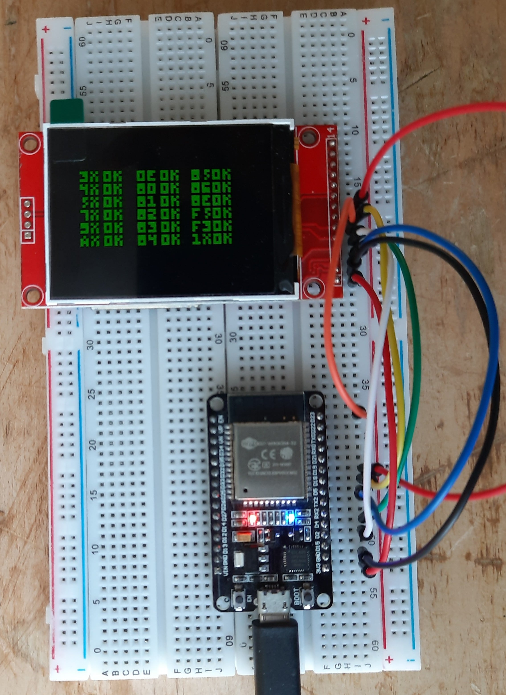

CHIP8 in ESP32 [WIP]
====================
This is a port of my [CHIP8](https://github.com/Panky-codes/CHIP8) implementation in ESP32.

## First look
I tested my implementation of OPCODES with the test ROM from [here](https://github.com/corax89/chip8-test-rom).

    

## TODO

- [ ] Finish up keyboard implementation
- [ ] Make a startup screen
