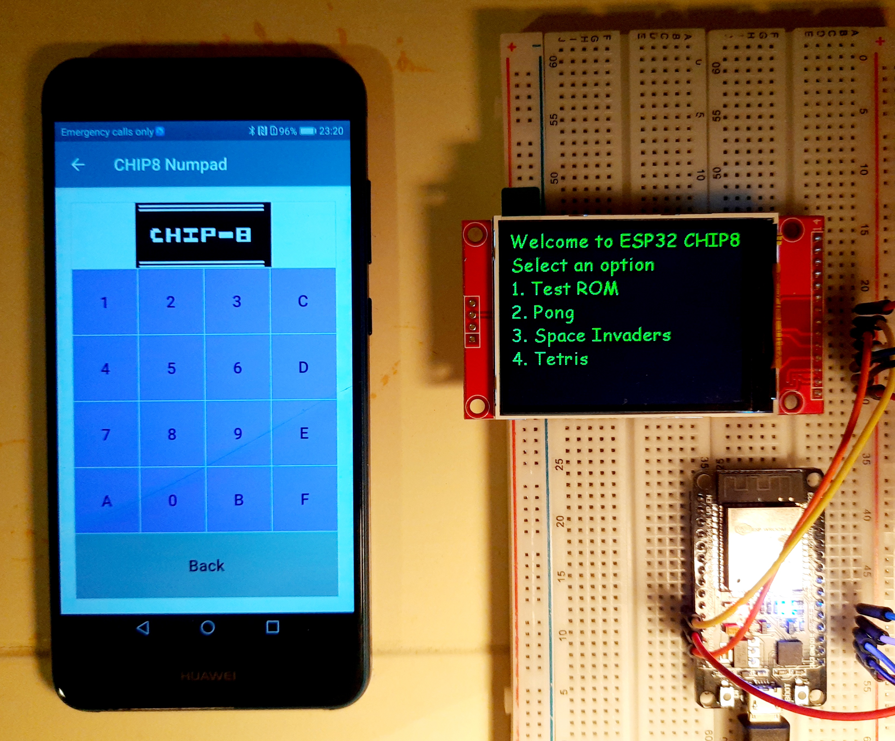

CHIP8 in ESP32
====================
This is a port of my [CHIP8](https://github.com/Panky-codes/CHIP8) implementation in C++17 for ESP32 microcontroller.

I have written a detailed article about this project in my [blog](https://pankajraghav.com).  The article can be found [here](https://pankajraghav.com/2020-12-12-CHIP8-ESP32).

<p align="center">
    
</p>

## Building and flashing
### Dependencies
- ESP-IDF > 4.0 installed 
- CMake
- Ninja

### Building

Download the github repository as follows:
```
$ git clone --recurse-submodules https://github.com/Panky-codes/ESP32-CHIP8.git  
```

After downloading this repository from github, go to the project root and execute the following command:

```
~/ESP32-CHIP8$ idf.py --ccache build
```

### Connection layout

| ESP32  | ILI9341 display  |
|---|---|
| D13 | MOSI   |
|  D12 | MISO   |
|  D14 |  CLK  |
|  D15 |  CS  |
|  D2 |   DC  |
|  D25 |  TCS  |
|  D4 |  RST  |
|  D19  |  BCKL  |

If you don't like the pinout chosen, you can modify them using menuconfig under TFT display.

### Flash and monitor
After connecting the ESP32 to the TFT display as per connection layout, you can flash and monitor the ESP32 by executing the following:

```
~/ESP32-CHIP8$ idf.py --ccache -p <your-port-name> -DFLASH_SPIFFS=1 flash monitor
```

`NOTE: -DFLASH_SPIFFS needs to be enabled when you flash the ESP32 for the first time. This flag copies the CHIP8 ROM.`
